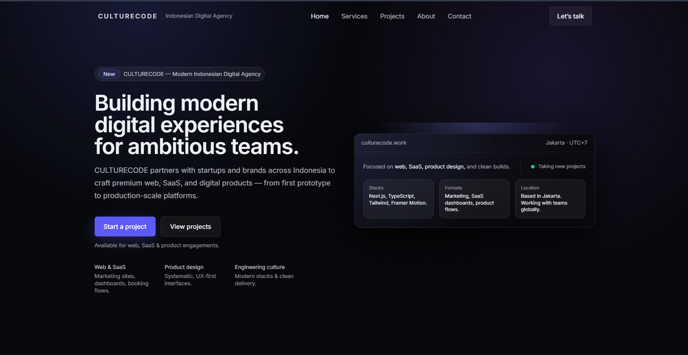
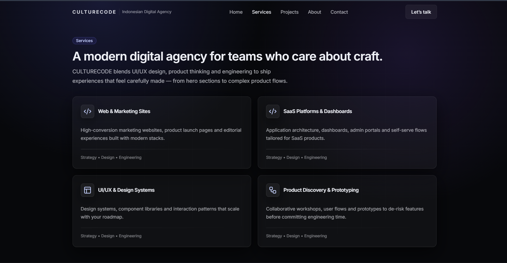
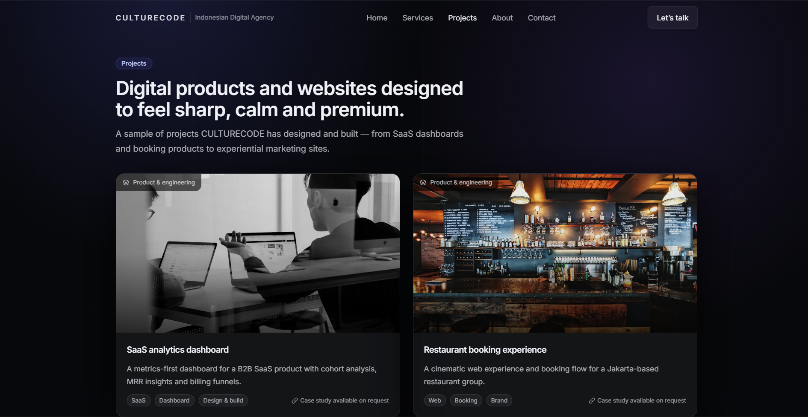

# CULTURECODE

**Building Modern Digital Experiences**

A premium digital product studio based in Jakarta, Indonesia. We craft web applications, SaaS platforms, and digital products that combine modern engineering culture with clean, intentional design.

---

## Preview

This repository contains the official CULTURECODE agency website — a modern SaaS-style marketing site built to showcase our work, services, and approach. The design draws inspiration from best-in-class product companies: minimal, fast, and focused on clarity. It serves as both our public presence and a reference implementation for the kind of work we deliver.

**Purpose:** A production-ready agency website that demonstrates our standards for typography, layout, motion, and component architecture. No templates. No shortcuts.

---

## Tech Stack

| Technology   | Purpose                    |
| ------------ | -------------------------- |
| **Next.js**  | App Router, SSR, routing    |
| **TypeScript** | Type safety, DX          |
| **Tailwind CSS** | Utility-first styling  |
| **shadcn/ui** | Accessible UI primitives |
| **Framer Motion** | Animations, transitions |

---

## Features

- **Modern SaaS design** — Dark theme, subtle gradients, refined spacing
- **Fully responsive** — Mobile, tablet, desktop
- **Smooth animations** — Scroll reveals, hover states, animated nav
- **Premium UI components** — Cards, buttons, badges, forms
- **Clean architecture** — Component-based, reusable patterns
- **No watermarks** — Production-ready output

---

## Screenshots

| Home | Services | Projects |
| ---- | -------- | -------- |
|  |  |  |

*Replace placeholders with actual screenshots for your repository.*

---

## Getting Started

```bash
# Clone the repository
git clone https://github.com/culturecode/agency-web-app.git
cd agency-web-app

# Install dependencies
npm install

# Start the development server
npm run dev
```

Open [http://localhost:3000](http://localhost:3000) in your browser.

---

## Project Structure

```
src/
├── app/                    # App Router pages
│   ├── page.tsx            # Home
│   ├── services/
│   ├── projects/
│   ├── about/
│   ├── contact/
│   ├── layout.tsx
│   └── globals.css
├── components/
│   ├── ui/                 # Base UI primitives (button, card, input, etc.)
│   ├── cards/              # Composed components
│   ├── navbar.tsx
│   ├── footer.tsx
│   ├── hero.tsx
│   ├── section.tsx
│   └── reveal.tsx          # Scroll-reveal wrapper
└── lib/
    └── utils.ts            # Utilities (cn, etc.)
```

---

## Philosophy

CULTURECODE is built on three principles:

**Clean code** — Readable, maintainable, and well-structured. Every component has a clear responsibility.

**Modern design** — Typography, spacing, and motion that feel deliberate. No clutter, no noise.

**Premium quality** — Output that could ship to enterprise clients. We don’t cut corners.

---

## Contact

**Email:** [hello@culturecode.id](mailto:hello@culturecode.id)

**Location:** Jakarta, Indonesia

---

© 2026 CULTURECODE. All rights reserved.
